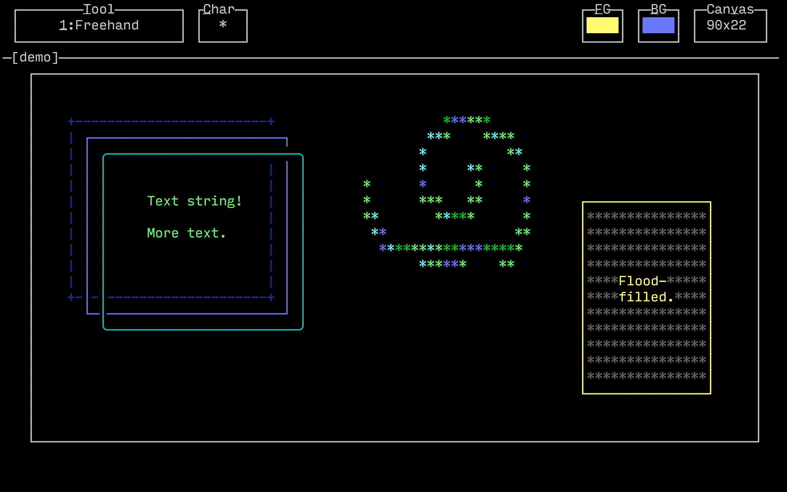

tart - terminal art program
===========================

```
 _____  _    ____ _____  _
(_   _)/ \  |    (_   _)| |
  | | / ^ \ |  O  || |  |_|
  | |/ ___ \|  _ < | |   _
  |_|_/   \_|_| \_\|_|  |_|
```

Tart is a program that provides an image-editor-like interface to
creating ASCII art. The best way to see how your ASCII art is going to
look in the terminal is to draw it in the terminal where it will be
displayed!



Features
========

- Image-editor-like interface
- Load and save ASCII art files (binary)
- Save plain versions of ASCII art for embedding in documents
- Save color versions of ASCII art with terminal escape sequences for
  printing to terminals
- Import existing plaintext files as the basis for new ASCII art files
- Drawing tools: freehand, box, flood fill
- Utility tools: repaint, eyedropper, eraser
- Multiple graphical styles for boxes
- Character selection for freehand and flood fill tools
- Set foreground and background color independently
- Set arbitrary canvas size
- Full mouse interaction and keyboard shortcuts
- Paste text from clipboard into canvas
- Undo (`u` key) / redo (`r` key)

How It Works
============

Tart requires a terminal with mouse support. You use various tools (such
as freehand drawing, boxes, etc.) to draw ASCII pictures. You can set a
current foreground and background color. You can also resize the drawing
canvas to get the desired output size. When you're finished, you can
save to disk, at which point Tart creates three files:

 * A binary file (say `foo`) suitable for reloading with Tart for
   further editing later
 * A text file `foo.color.txt` containing the ASCII art with terminal
   color escape sequences, suitable for emitting to terminals
 * A text file `foo.plain.txt` containing the ASCII art without terminal
   color escape sequences, suitable for embedding in documentation
